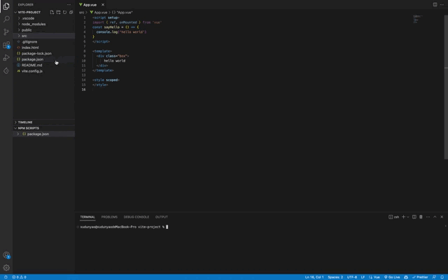

<h4>1:How to use？</h4>

Click the breakpoint to automatically insert or delete "debugger;"

<h4>2:How to prohibit?</h4>

Click the bug icon in the bottom status bar to switch between two different states
